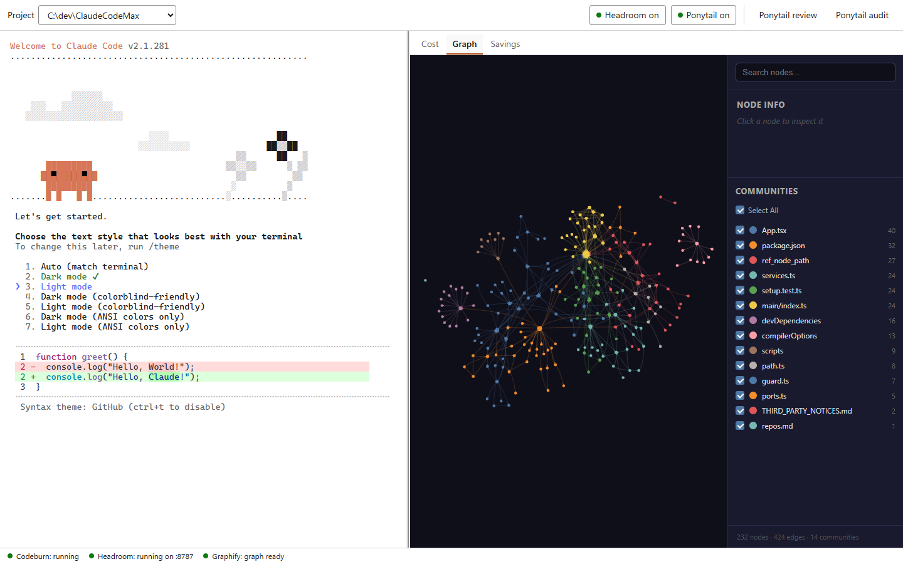
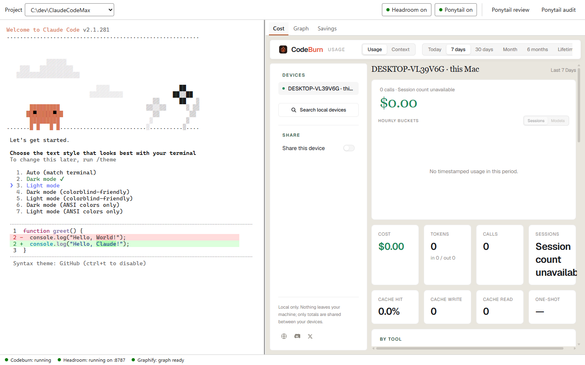
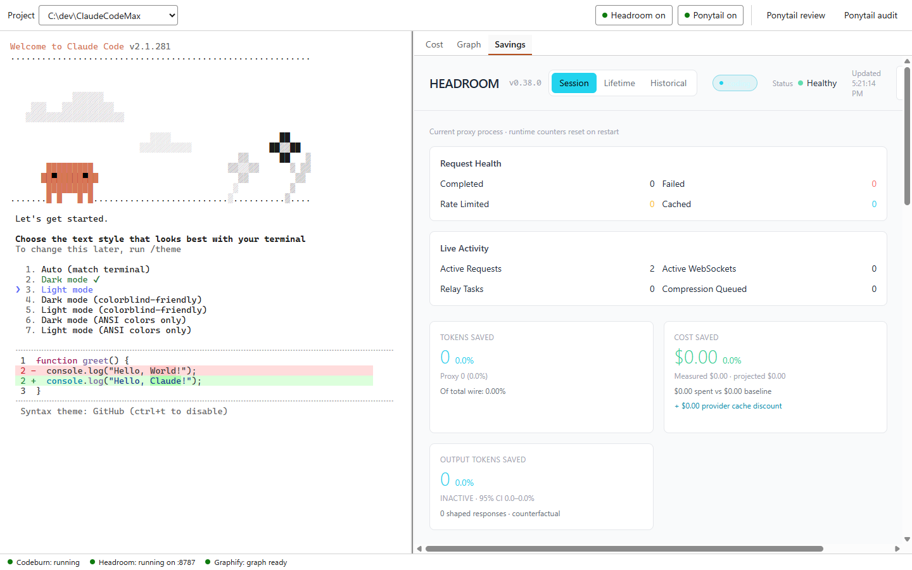
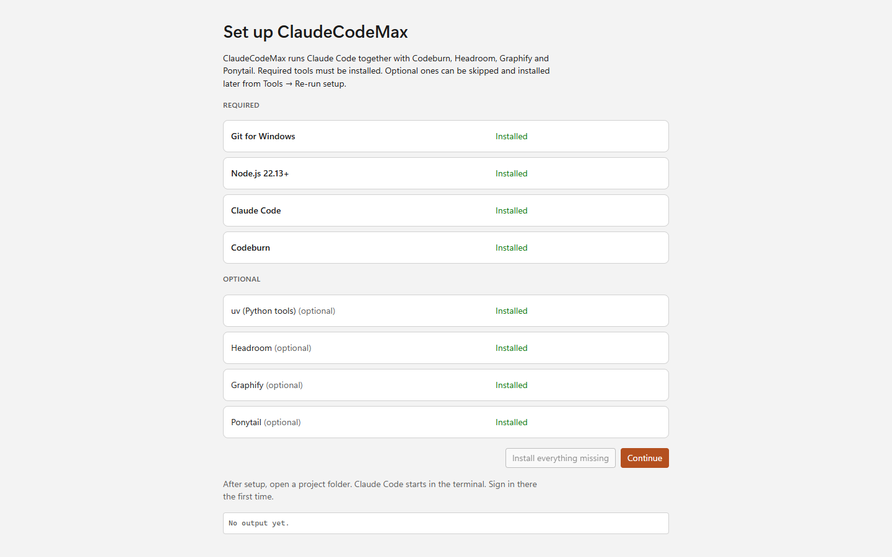

<div align="center">


# ClaudeCodeMax

**Claude Code in one Windows 11 window, with your costs, a map of your code and token savings right beside it.**

[](https://github.com/countryboysplay/ClaudeCodeMax/releases) [](https://github.com/countryboysplay/ClaudeCodeMax/actions/workflows/ci.yml) [](LICENSE) [](#install) [](https://www.electronjs.org/)

<br>

<a href="https://github.com/countryboysplay/ClaudeCodeMax/releases/latest"></a>

<sub>Free and open source · Per-user install, no admin rights · Unofficial community project</sub>

<br><br>

<picture>
  <source media="(prefers-color-scheme: dark)" srcset="docs/screenshots/dashboard-graph-dark.png">
  
</picture>

</div>

<br>

## Why ClaudeCodeMax?

Claude Code is great in a terminal. But to see what a session costs, how your code fits together, or how many tokens a proxy saved, you end up juggling extra terminals, browser tabs and install guides.

ClaudeCodeMax puts all of it in one window. It installs four community tools for you and runs them next to Claude Code:

- **[Codeburn](https://github.com/getagentseal/codeburn)** shows what your sessions cost.
- **[Graphify](https://github.com/Graphify-Labs/graphify)** turns your project into an interactive knowledge graph.
- **[Headroom](https://github.com/headroomlabs-ai/headroom)** compresses context through a local proxy, so you send fewer tokens.
- **[Ponytail](https://github.com/dietrichgebert/ponytail)** is a Claude Code plugin that keeps Claude's code minimal.

You don't have to open a second terminal.

## Features

<table>
  <tr>
    <td width="50%" valign="top">
      <picture>
        <source media="(prefers-color-scheme: dark)" srcset="docs/screenshots/dashboard-cost-dark.png">
        
      </picture>
      <h3>💸 Cost at a glance</h3>
      The <b>Cost</b> tab embeds Codeburn's own dashboard: spend, tokens, calls and cache hits by day, week or month.
    </td>
    <td width="50%" valign="top">
      <picture>
        <source media="(prefers-color-scheme: dark)" srcset="docs/screenshots/dashboard-savings-dark.png">
        
      </picture>
      <h3>📉 Token savings</h3>
      With <b>Headroom on</b>, Claude Code talks to a local Headroom proxy. The <b>Savings</b> tab shows its live dashboard.
    </td>
  </tr>
  <tr>
    <td width="50%" valign="top">
      <picture>
        <source media="(prefers-color-scheme: dark)" srcset="docs/screenshots/dashboard-graph-dark.png">
        
      </picture>
      <h3>🕸️ A map of your code</h3>
      The <b>Graph</b> tab shows Graphify's interactive graph for the open project. It reloads by itself when the graph is rebuilt.
    </td>
    <td width="50%" valign="top">
      <picture>
        <source media="(prefers-color-scheme: dark)" srcset="docs/screenshots/wizard-dark.png">
        
      </picture>
      <h3>🧰 One-click setup</h3>
      On first run, a setup wizard checks for each tool and installs anything missing. You can watch the output as it runs.
    </td>
  </tr>
</table>

<table>
  <tr>
    <td width="33%" valign="top"><b>🪮 Ponytail built in</b><br>Turn the plugin on or off from the header. One-click <i>Ponytail review</i> and <i>Ponytail audit</i> buttons.</td>
    <td width="33%" valign="top"><b>🔄 Updates itself</b><br>The app updates from GitHub Releases. The tools update when you choose <i>Check for tool updates</i>.</td>
    <td width="33%" valign="top"><b>🌗 Light and dark</b><br>Follows your Windows theme. WCAG AA contrast, visible focus and a full keyboard path.</td>
  </tr>
  <tr>
    <td width="33%" valign="top"><b>🩺 Self-healing services</b><br>If a background tool crashes, the app restarts it (up to 3 tries) and shows its last output.</td>
    <td width="33%" valign="top"><b>🧹 Clean exit</b><br>When you quit, the app ends every process it started, including Claude Code.</td>
    <td width="33%" valign="top"><b>🔒 Locked-down panels</b><br>Panels only load <code>localhost</code> pages and your project's graph file. Other links open in your browser.</td>
  </tr>
</table>

## How it works

```
┌──────────────────────────────────────────────────────────────────────────┐
│ Project: C:\code\myapp  v     Headroom: on   Ponytail: on   review audit │
├────────────────────────────────────┬─────────────────────────────────────┤
│                                    │  [ Cost ]  [ Graph ]  [ Savings ]   │
│   Claude Code terminal             │                                     │
│   (xterm.js + node-pty, runs       │   the selected tool's own web UI    │
│    `claude` in your project)       │   (an embedded <webview>)           │
│                                    │                                     │
├────────────────────────────────────┴─────────────────────────────────────┤
│ Codeburn: running   Headroom: running on :8787   Graphify: graph ready   │
└──────────────────────────────────────────────────────────────────────────┘
```

1. **You open a project folder.** ClaudeCodeMax starts `claude` in that folder, inside the built-in terminal.
2. **Codeburn** runs in the background (`codeburn web`) and serves its dashboard on `localhost`. That page is the **Cost** tab.
3. **Headroom** (when on) runs `headroom proxy` on `127.0.0.1`. Claude Code starts with `ANTHROPIC_BASE_URL` pointed at the proxy. Headroom's dashboard is the **Savings** tab. Turning Headroom on or off restarts the Claude session, because Claude Code only reads that variable when it starts.
4. **Graphify** has nothing running in the background. **Build graph** asks Claude to run `/graphify .`, which writes `graphify-out/graph.html` in your project. The **Graph** tab shows that file.
5. **Ponytail** runs inside Claude Code as a plugin. The header toggle turns it on or off with `claude plugin enable|disable`. The two buttons type `/ponytail-review` and `/ponytail-audit` into the session.

If a default port is taken, the app picks a free one and passes it to both the tool and Claude.

## Install

1. Download `ClaudeCodeMax-Setup-x.y.z.exe` from **[Releases](https://github.com/countryboysplay/ClaudeCodeMax/releases)**.
2. The installer isn't code-signed, so Windows SmartScreen may say **"Windows protected your PC"**. Click **More info → Run anyway**.
3. The installer is per-user, so you don't need admin rights. You can choose the install folder.
4. On first launch, the **setup wizard** checks for these tools and installs anything missing:

   | Tool | Required | Installed with |
   |---|:---:|---|
   | Git for Windows | ✅ | `winget install --id Git.Git` |
   | Node.js 22.13+ | ✅ | `winget install --id OpenJS.NodeJS.LTS` |
   | Claude Code | ✅ | the official installer (`irm https://claude.ai/install.ps1 \| iex`) |
   | Codeburn | ✅ | `npm install -g codeburn` |
   | uv (Python tools) | for Headroom or Graphify | `winget install --id astral-sh.uv` |
   | Headroom | optional | `uv tool install --python 3.13 "headroom-ai[all]"` |
   | Graphify | optional | `uv tool install graphifyy`, then `graphify install` |
   | Ponytail | optional | `claude plugin marketplace add DietrichGebert/ponytail`, then `claude plugin install ponytail@ponytail` |

   You can skip any optional tool and install it later from **Tools → Re-run setup**. After each install, the app reloads your PATH, so you don't need to reboot.
5. **Open a project folder.** Claude Code starts in the terminal. The first time, **sign in there** using Claude Code's own sign-in. ClaudeCodeMax never sees or stores your credentials.

## Using it

| Where | What it does |
|---|---|
| **Project ▾** (header) | Pick a folder or reopen a recent one (the last 10 are saved). **File → Open Project…** or <kbd>Ctrl</kbd>+<kbd>Shift</kbd>+<kbd>O</kbd> does the same. |
| **Headroom on/off** | Routes Claude through the Headroom proxy, or not. Claude restarts so the change takes effect. |
| **Ponytail on/off** | Turns the Ponytail plugin on or off in Claude Code, then restarts Claude. |
| **Ponytail review / audit** | Types `/ponytail-review` (over-engineering review of your changes) or `/ponytail-audit` (whole-repo audit) into Claude. |
| **Graph → Build graph** | Shown when the project has no graph yet. It asks Claude to run `/graphify .`. The tab updates when `graph.html` appears. |
| **Divider** | Drag it, or focus it and use the arrow keys, to resize the terminal and the panels. The app remembers the split and the last tab you used. |
| **Tools → Check for tool updates** | Stops the tools, runs `npm update -g codeburn`, `uv tool upgrade headroom-ai graphifyy`, `claude update` and `claude plugin update ponytail@ponytail`, then starts everything again. The output is shown as it runs. |
| **Tools → Re-run setup** | Opens the setup wizard again, for example to install a tool you skipped. |
| **Help → Third-party licenses** | Opens [THIRD_PARTY_NOTICES.md](THIRD_PARTY_NOTICES.md). |
| <kbd>F6</kbd> | The terminal sends every key to Claude, including <kbd>Tab</kbd>. Press <kbd>F6</kbd> to move keyboard focus out of the terminal. |
| <kbd>Ctrl</kbd>+<kbd>Shift</kbd>+<kbd>C</kbd> | Copies the selected text in the terminal. |

When Claude exits, the terminal shows **Session ended** with a **Restart** button. If the Headroom proxy goes down while Claude is using it, a banner lets you restart Headroom or relaunch Claude without it. The app never switches Claude off the proxy without asking.

## Privacy and security

- **Your credentials stay with Claude Code.** You sign in through Claude Code's own flow in the terminal. ClaudeCodeMax doesn't read, store or send any account details or API keys.
- **The app sends nothing about you.** It has no telemetry or analytics. Its only network request is the update check against this repo's GitHub Releases, when you run the installed app.
- **The tools behave as their authors designed.** Claude Code talks to Anthropic, and with Headroom on it goes through the local proxy first. Codeburn reads your local session logs. Headroom's own telemetry is off by default. Graphify's `graph.html` loads its graph library from a CDN (unpkg.com). Each tool's README explains what it does.
- **The panels are sandboxed.** The UI runs with `contextIsolation`, `sandbox` and no Node integration. A `will-attach-webview` guard removes preloads and only allows `http://localhost:*`, `http://127.0.0.1:*` and files inside `<project>/graphify-out/`. Any other link opens in your browser, and only if it's `https:`.
- **The app stores very little.** `%APPDATA%\ClaudeCodeMax\settings.json` holds your recent projects, the two toggles, skipped tools and the layout. That's all.

## Develop

Requires Windows 11, Node.js 22.13+ and Git.

```bash
npm install
npm run dev         # run with hot reload
npm run typecheck   # TypeScript
npm test            # unit tests (Vitest)
npm run smoke       # end-to-end test (Playwright + Electron) with a fake claude and stub services
npm run dist        # build dist/ClaudeCodeMax-Setup-<version>.exe
```

Useful environment variables for testing: `CCM_USER_DATA` (use a different settings folder), `CCM_PROJECT` (open this folder on launch), `CCM_FORCE_SETUP=1` / `CCM_SKIP_SETUP=1` (always or never show the wizard), and `CCM_CMD_CLAUDE`, `CCM_CMD_CODEBURN`, `CCM_CMD_HEADROOM` (swap in other commands; in the two service commands, `{port}` is replaced with the chosen port).

<details>
<summary><b>Project layout</b></summary>

```
src/main/       Electron main process: window, services, PTY, setup wizard, PATH refresh, webview guard
src/preload/    typed bridge between the main process and the UI
src/renderer/   React UI: terminal, panels, setup wizard, status bar
src/shared/     types shared by main and renderer
test/           Vitest unit tests + Playwright smoke test and fixtures
```
</details>

## Release

1. Bump `version` in `package.json` and commit.
2. `git tag vX.Y.Z && git push --tags`
3. The [release workflow](.github/workflows/release.yml) runs the type check, unit tests and smoke test on `windows-latest`. Then it builds the NSIS installer and publishes a GitHub Release. Installed copies find the update the next time they start, download it, and offer **Restart to update**.

Before tagging, test the installer on a clean Windows 11 VM or Windows Sandbox: the SmartScreen flow, the wizard installing from scratch, the sign-in, and a clean quit.

## FAQ

<details>
<summary><b>Why does Windows warn me about the installer?</b></summary>

The installer isn't code-signed, because signing certificates cost money every year. SmartScreen warns about unsigned downloads it hasn't seen often. Click **More info → Run anyway**. The whole build runs in public GitHub Actions from this repo's source, if you'd like to check it.
</details>

<details>
<summary><b>Do I need a Claude subscription or an API key?</b></summary>

You need whatever Claude Code itself needs. ClaudeCodeMax runs the real `claude` command, and you sign in inside the terminal just as you would in any other terminal.
</details>

<details>
<summary><b>Can I skip Headroom, Graphify or Ponytail?</b></summary>

Yes. Only Git, Node.js, Claude Code and Codeburn are required. A skipped tool's panel or toggle shows an **Install** button that reopens the wizard.
</details>

<details>
<summary><b>Does building the graph use tokens?</b></summary>

**Build graph** runs Graphify's `/graphify .` command inside Claude, so it uses your Claude session. To build a code-only graph without an LLM, run `graphify update .` in your project folder. The Graph tab picks up the new `graph.html` automatically.
</details>

<details>
<summary><b>The Savings tab says the proxy isn't running</b></summary>

Headroom downloads some tokenizer data the first time it starts, so that first start needs an internet connection. If Headroom fails, the app retries up to 3 times. After that, click **Restart Headroom** and check the log it shows.
</details>

<details>
<summary><b>How do I uninstall?</b></summary>

Use **Settings → Apps → Installed apps → ClaudeCodeMax → Uninstall**. The tools the wizard installed are separate programs and stay installed. Remove them with `npm uninstall -g codeburn`, `uv tool uninstall headroom-ai graphifyy`, `claude plugin uninstall ponytail@ponytail`, or through winget.
</details>

<details>
<summary><b>macOS or Linux?</b></summary>

Not yet. Version 1 is Windows 11 only.
</details>

## Acknowledgements

ClaudeCodeMax is mostly glue. The real work is done by the projects below, and each of them keeps its own license. **Thank you to every author and contributor.** Your work made this app possible.

### The tools it brings together

| Project | License | What it does in ClaudeCodeMax |
|---|---|---|
| [**Claude Code**](https://github.com/anthropics/claude-code) by Anthropic | Anthropic terms | The AI coding agent that runs in the terminal |
| [**Codeburn**](https://github.com/getagentseal/codeburn) | MIT | Token and cost tracking, shown in the **Cost** tab |
| [**Headroom**](https://github.com/headroomlabs-ai/headroom) | Apache-2.0 | The local context-compression proxy, with its dashboard in the **Savings** tab |
| [**Graphify**](https://github.com/Graphify-Labs/graphify) | Apache-2.0 | The codebase knowledge graph in the **Graph** tab |
| [**Ponytail**](https://github.com/dietrichgebert/ponytail) | MIT | The Claude Code plugin behind the toggle and the review and audit buttons |

The wizard also installs [Git for Windows](https://gitforwindows.org/), [Node.js](https://nodejs.org/) and [uv](https://github.com/astral-sh/uv) from their official sources.

### What the app is built with

| Project | License | Role |
|---|---|---|
| [Electron](https://github.com/electron/electron) | MIT | The desktop shell |
| [electron-vite](https://github.com/alex8088/electron-vite) | MIT | Build tooling for main, preload and renderer |
| [Vite](https://github.com/vitejs/vite) and [@vitejs/plugin-react](https://github.com/vitejs/vite-plugin-react) | MIT | Bundler and React support |
| [React](https://github.com/facebook/react) | MIT | The UI |
| [xterm.js](https://github.com/xtermjs/xterm.js) (`@xterm/xterm`, `@xterm/addon-fit`) | MIT | The terminal |
| [@lydell/node-pty](https://github.com/lydell/node-pty), a smaller build of [microsoft/node-pty](https://github.com/microsoft/node-pty) | MIT | The pseudo-terminal that runs `claude` |
| [electron-builder and electron-updater](https://github.com/electron-userland/electron-builder) | MIT | The NSIS installer and auto-updates from GitHub Releases |
| [TypeScript](https://github.com/microsoft/TypeScript) | Apache-2.0 | The language |
| [Vitest](https://github.com/vitest-dev/vitest) | MIT | Unit tests |
| [Playwright](https://github.com/microsoft/playwright) | Apache-2.0 | End-to-end smoke tests and screenshots |

### How it was made

| Project | License | Role |
|---|---|---|
| [**Superpowers**](https://github.com/obra/superpowers) by Jesse Vincent | MIT | The Claude Code skills used to brainstorm, plan, test-drive and review this app |
| [**LibreUIUX-Claude-Code**](https://github.com/HermeticOrmus/LibreUIUX-Claude-Code) by Hermetic Ormus | MIT | The design toolkit used for the visual direction and the accessibility review. It isn't shipped in the app. |

Full license notices are in [THIRD_PARTY_NOTICES.md](THIRD_PARTY_NOTICES.md).

---

<div align="center">
<sub>
ClaudeCodeMax is an <b>unofficial community project</b>. It isn't affiliated with or endorsed by Anthropic or by the authors of Codeburn, Headroom, Graphify or Ponytail. "Claude" and "Claude Code" are trademarks of Anthropic.
<br>
Released under the <a href="LICENSE">MIT License</a>.
</sub>
</div>
